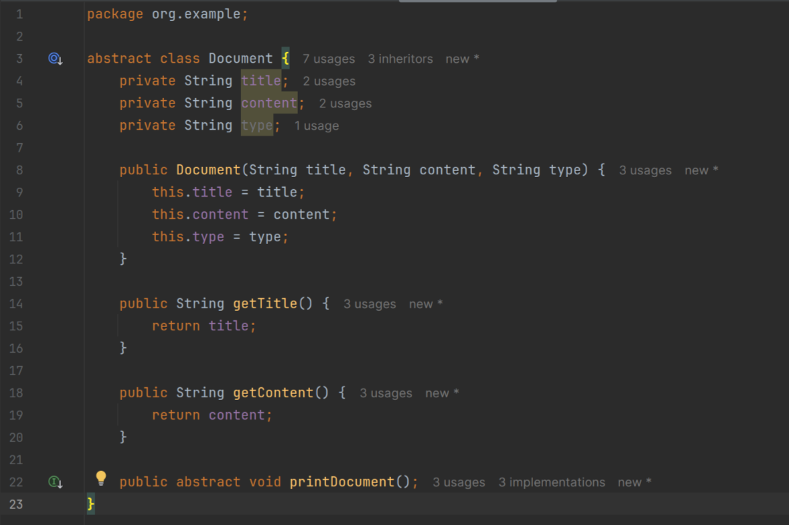
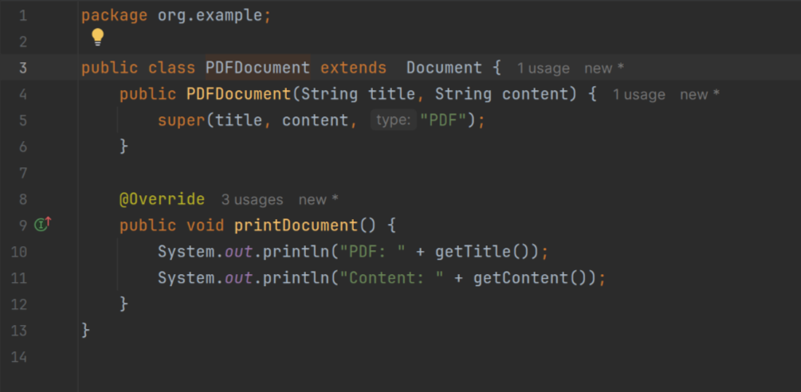
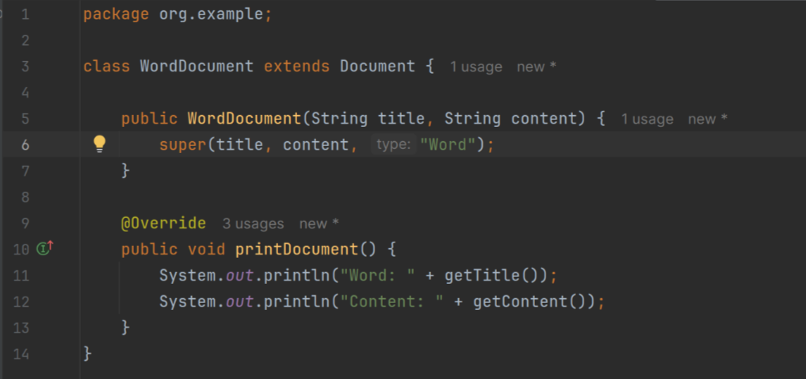
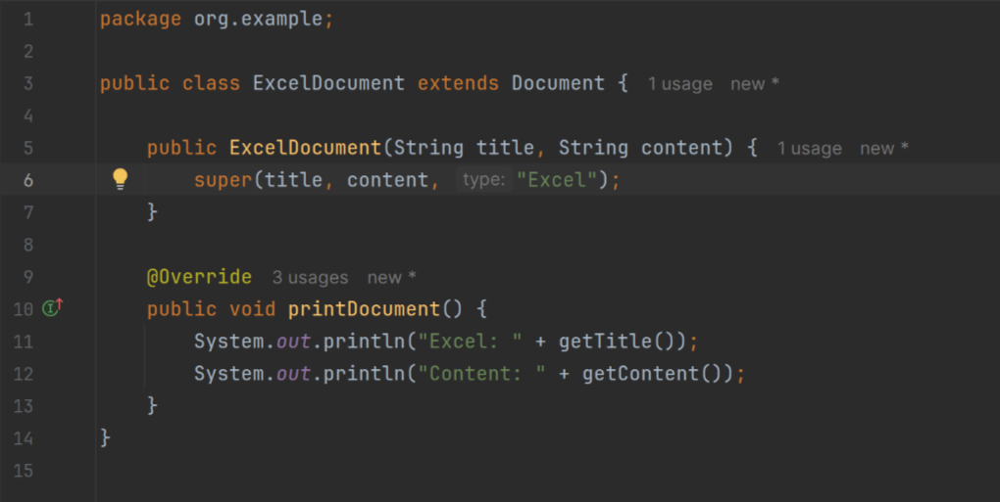
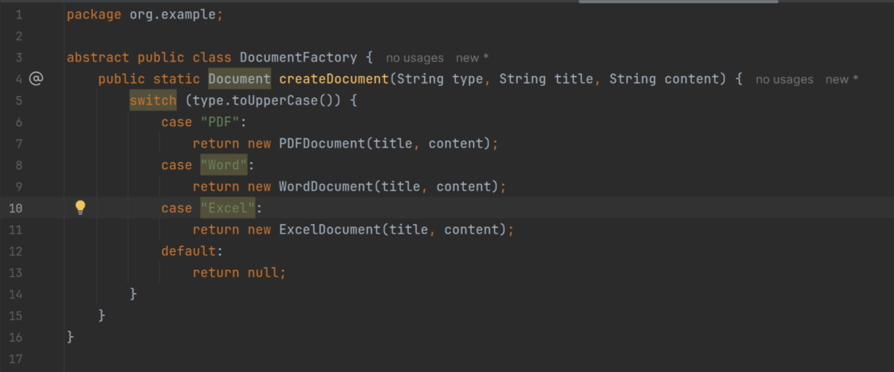
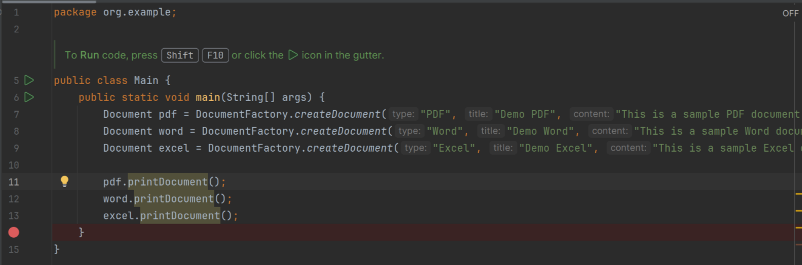
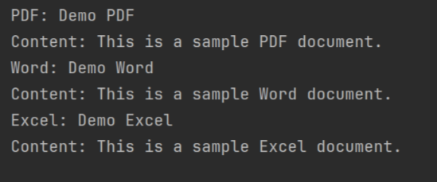

# Factory Pattern Example

## Code

### Document Abstract Class

### PDF Document Class

### Word Document Class

### Excel Document Class

### Document Factory Class

### Main Class

## Output

